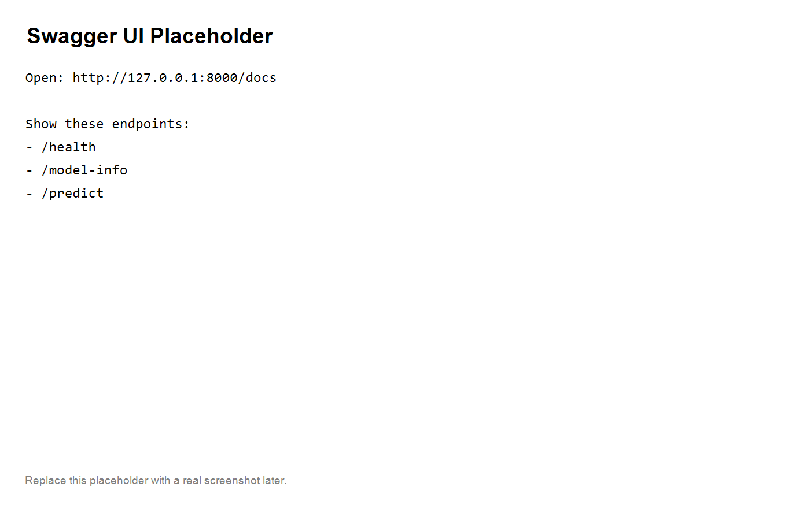
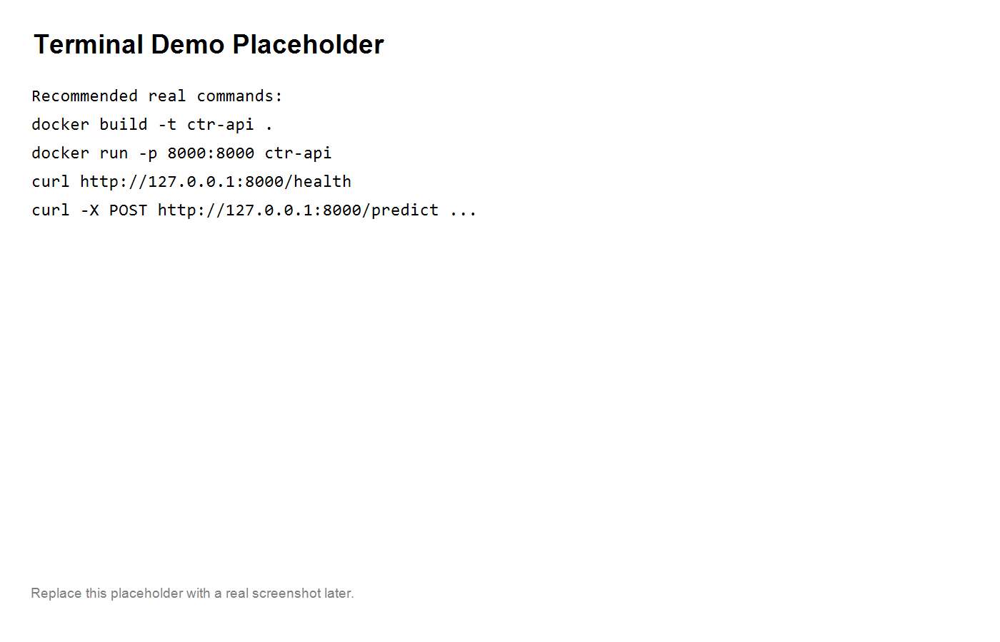

# CTR API — FastAPI + Docker

Production-style inference API for CTR models.

Part of end-to-end pipeline:
training → serving → logging → retraining


FastAPI + Docker serving demo for CTR-style model inference.

This repository is a lightweight serving proof that complements [`ctr-seqrec-avazu`](https://github.com/yoonjihyung2023/ctr-seqrec-avazu).


## Live Demo

- Swagger UI: https://ctr-api.onrender.com/docs
- Health check: https://ctr-api.onrender.com/health

## Why this repo matters

- Shows a simple model serving API
- Uses FastAPI for inference endpoints
- Includes Docker workflow for reproducible local serving
- Gives recruiter-visible proof beyond offline training metrics

## API endpoints

- `GET /health`
- `GET /model-info`
- `POST /predict`

## Example prediction

```json
{
  "ok": true,
  "request_id": "demo",
  "score": 0.732
}
```

## Latency note

~10–20 ms per request in a lightweight local CPU demo setting.

This is not a production benchmark; it is a recruiter-visible serving demo.

## Quickstart

### Run locally

```bash
python -m uvicorn app.main:app --host 0.0.0.0 --port 8000
```

### Run with Docker

```bash
docker build -t ctr-api .
docker run -p 8000:8000 ctr-api
```

## Example requests

### Health check

```bash
curl http://127.0.0.1:8000/health
```

Expected response:

```json
{
  "status": "ok"
}
```

### Model info

```bash
curl http://127.0.0.1:8000/model-info
```

Expected response:

```json
{
  "model_path": "demo",
  "device": "cpu"
}
```

### Predict

```bash
curl -X POST http://127.0.0.1:8000/predict ^
  -H "Content-Type: application/json" ^
  -d "{\"features\":[1,2,3],\"request_id\":\"demo\"}"
```

Expected response:

```json
{
  "request_id": "demo",
  "score": 6.0
}
```

## PowerShell test examples

```powershell
irm http://127.0.0.1:8000/health | ConvertTo-Json -Depth 5
irm http://127.0.0.1:8000/model-info | ConvertTo-Json -Depth 5

$body = @{ features = @(1,2,3); request_id = "demo" } | ConvertTo-Json

irm http://127.0.0.1:8000/predict `
  -Method POST `
  -ContentType "application/json" `
  -Body $body |
  ConvertTo-Json -Depth 5
```

## Visible proof

### Swagger / OpenAPI

FastAPI exposes interactive API docs at:

- Local: http://127.0.0.1:8000/docs
- Live: https://ctr-api.onrender.com/docs

Screenshot placeholder:



### Terminal demo

Example local serving run with Docker and sample requests:



## Repository structure

```text
app/
  main.py
Dockerfile
README.md
```

## Positioning

This repo is meant to show a practical serving layer for an ML portfolio:

- Offline model evidence: [`ctr-seqrec-avazu`](https://github.com/yoonjihyung2023/ctr-seqrec-avazu)
- Online inference demo: `ctr-api`
